# CSE451 — Secure Communication Suite
## Complete Technical Documentation

> **Ain Shams University | Faculty of Engineering | Computer & Systems Dept.**
> **CSE451: Computer and Network Security — Spring 2026**

---

## Table of Contents

1. [Project Overview](#1-project-overview)
2. [System Architecture](#2-system-architecture)
3. [Full Workflow Explanation](#3-full-workflow-explanation)
4. [Module & Function Breakdown](#4-module--function-breakdown)
5. [Security Logic & Detection Flow](#5-security-logic--detection-flow)
6. [Folder & File Structure](#6-folder--file-structure)
7. [Execution Flow](#7-execution-flow)
8. [Technical Design Decisions](#8-technical-design-decisions)
9. [Error Handling & Edge Cases](#9-error-handling--edge-cases)
10. [Summary](#10-summary)

---

## 1. Project Overview

### What Is This System?

The **Secure Communication Suite** is a Python application that implements a complete, production-grade secure communication channel from scratch. It demonstrates how modern security systems protect data — both in transit (over a network) and at rest (stored on disk) — by combining multiple cryptographic techniques into a unified pipeline.

Think of it as a miniature version of what happens every time you use HTTPS, SSH, or a secure messaging app — but with every layer exposed and explained.

### The Real-World Problem It Solves

When two parties communicate over a network, three fundamental problems must be solved simultaneously:

| Problem | Question | Threat |
|---|---|---|
| **Confidentiality** | Can a third party read the data? | Eavesdropping / Man-in-the-Middle |
| **Integrity** | Has the data been tampered with? | Data modification / Bit-flipping attacks |
| **Authentication** | Is the communicating party who they claim to be? | Impersonation / Spoofing |

This system solves all three problems using well-established cryptographic primitives and combines them into a working client-server protocol.

### Main Features

| Feature | Technology | File |
|---|---|---|
| Symmetric encryption of messages | AES-128-EAX | `modules/aes_module.py` |
| Asymmetric encryption for key exchange | RSA-2048-OAEP | `modules/rsa_module.py` |
| Message integrity verification | SHA-256 | `modules/hash_module.py` |
| Secure key storage (disk) | scrypt + AES-256-CBC | `modules/key_manager.py` |
| User identity verification | bcrypt password hashing | `modules/auth_module.py` |
| End-to-end secure TCP communication | Hybrid encryption protocol | `demo/server.py`, `demo/client.py` |
| Interactive demonstration CLI | Python subprocess + input() | `main.py` |
| Full unit test suite (31 tests) | Python unittest conventions | `tests/` |

### Technologies & Libraries

| Library | Version | Purpose |
|---|---|---|
| `pycryptodome` | 3.20.0 | AES, RSA, SHA-256 cryptographic primitives |
| `bcrypt` | 4.1.3 | Password hashing with salt |
| `socket` | stdlib | TCP network communication |
| `threading` | stdlib | Background encryption worker thread |
| `json` | stdlib | Message envelope serialization |
| `struct` | stdlib | Binary length-prefix framing |
| `subprocess` | stdlib | Running tests and demo processes |

### Expected Inputs and Outputs

```
INPUT  → plaintext message (bytes) + cryptographic keys
OUTPUT → encrypted ciphertext (bytes) + nonce + authentication tag

INPUT  → username + password
OUTPUT → bcrypt hash (stored) / True/False (on verification)

INPUT  → client connection + credentials + AES session key (RSA-encrypted)
OUTPUT → authenticated secure channel, echoed encrypted messages
```

---

## 2. System Architecture

### High-Level Component Map

```mermaid
graph TB
    CLI(["main.py<br/>Interactive CLI Entry Point"])

    subgraph MODULES["Core Cryptographic Modules (modules/)"]
        direction TB
        AES["aes_module.py<br/>AES-128-EAX Encryption"]
        RSA["rsa_module.py<br/>RSA-2048-OAEP"]
        HASH["hash_module.py<br/>SHA-256 Hashing"]
        KEY["key_manager.py<br/>Key Storage & Loading"]
        AUTH["auth_module.py<br/>bcrypt Authentication"]
    end

    subgraph DEMO["Network Demo (demo/)"]
        direction TB
        SERVER["server.py<br/>TCP Server · 127.0.0.1:65432"]
        CLIENT["client.py<br/>TCP Client"]
        USERDB["users.json<br/>Bcrypt Password Store"]
    end

    subgraph TESTS["Test Suite (tests/)"]
        direction TB
        T1["test_aes.py — 8 tests"]
        T2["test_rsa.py — 6 tests"]
        T3["test_hash.py — 6 tests"]
        T4["test_key_manager.py — 4 tests"]
        T5["test_auth.py — 7 tests"]
    end

    CLI --> AES
    CLI --> RSA
    CLI --> HASH
    CLI --> KEY
    CLI --> AUTH
    CLI --> SERVER
    CLI --> CLIENT
    CLI --> TESTS

    SERVER --> RSA
    SERVER --> AES
    SERVER --> HASH
    SERVER --> AUTH
    SERVER --> USERDB

    CLIENT --> RSA
    CLIENT --> AES
    CLIENT --> HASH

    KEY --> RSA
    KEY --> AES

    style CLI  fill:#e0e7ff,stroke:#4f46e5,stroke-width:2px,color:#312e81
    style AES  fill:#d1fae5,stroke:#059669,stroke-width:2px,color:#064e3b
    style RSA  fill:#d1fae5,stroke:#059669,stroke-width:2px,color:#064e3b
    style HASH fill:#d1fae5,stroke:#059669,stroke-width:2px,color:#064e3b
    style KEY  fill:#e0e7ff,stroke:#4f46e5,stroke-width:2px,color:#312e81
    style AUTH fill:#d1fae5,stroke:#059669,stroke-width:2px,color:#064e3b
    style SERVER fill:#ffedd5,stroke:#ea580c,stroke-width:2px,color:#7c2d12
    style CLIENT fill:#dbeafe,stroke:#2563eb,stroke-width:2px,color:#1e3a5f
    style USERDB fill:#f3f4f6,stroke:#6b7280,stroke-width:2px,color:#374151
    style T1 fill:#f3f4f6,stroke:#6b7280,stroke-width:2px,color:#374151
    style T2 fill:#f3f4f6,stroke:#6b7280,stroke-width:2px,color:#374151
    style T3 fill:#f3f4f6,stroke:#6b7280,stroke-width:2px,color:#374151
    style T4 fill:#f3f4f6,stroke:#6b7280,stroke-width:2px,color:#374151
    style T5 fill:#f3f4f6,stroke:#6b7280,stroke-width:2px,color:#374151
    style MODULES fill:#ecfdf5,stroke:#059669,stroke-width:2px,color:#064e3b
    style DEMO   fill:#fff7ed,stroke:#ea580c,stroke-width:2px,color:#7c2d12
    style TESTS  fill:#f8fafc,stroke:#94a3b8,stroke-width:1px,color:#475569
```

### How Components Communicate

The system has two distinct communication layers:

1. **Intra-process (function calls):** The CLI, server, and client all call the same module functions directly. There are no APIs or message queues between modules — they share Python memory.

2. **Inter-process (TCP sockets):** The server and client communicate over a real TCP connection on `127.0.0.1:65432`. All data sent on this channel is encrypted.

### Data Flow Overview

```mermaid
flowchart LR
    subgraph CLIENT_SIDE["Client Side"]
        direction TB
        C1(["Plaintext Message"])
        C2["AES Session Key<br/>(16 random bytes)"]
        C3["SHA-256 Hash"]
        C4["JSON Envelope<br/>{hash, data}"]
        C5["AES-EAX Encrypted Payload"]
    end

    subgraph NETWORK["TCP Network"]
        direction TB
        N1["[4B nonce][4B tag]<br/>[4B ciphertext]"]
    end

    subgraph SERVER_SIDE["Server Side"]
        direction TB
        S1["AES-EAX Decrypt"]
        S2["JSON Parse"]
        S3["SHA-256 Verify"]
        S4(["Plaintext Recovered"])
    end

    C1 --> C3
    C1 --> C4
    C3 --> C4
    C2 --> C5
    C4 --> C5
    C5 ==> N1
    N1 ==> S1
    C2 -.->|"RSA-encrypted<br/>during handshake"| S1
    S1 --> S2
    S2 --> S3
    S3 --> S4

    style C1 fill:#dbeafe,stroke:#2563eb,stroke-width:2px,color:#1e3a5f
    style C2 fill:#e0e7ff,stroke:#4f46e5,stroke-width:2px,color:#312e81
    style C3 fill:#d1fae5,stroke:#059669,stroke-width:2px,color:#064e3b
    style C4 fill:#dbeafe,stroke:#2563eb,stroke-width:2px,color:#1e3a5f
    style C5 fill:#d1fae5,stroke:#059669,stroke-width:2px,color:#064e3b
    style N1 fill:#ffedd5,stroke:#ea580c,stroke-width:2px,color:#7c2d12
    style S1 fill:#d1fae5,stroke:#059669,stroke-width:2px,color:#064e3b
    style S2 fill:#d1fae5,stroke:#059669,stroke-width:2px,color:#064e3b
    style S3 fill:#d1fae5,stroke:#059669,stroke-width:2px,color:#064e3b
    style S4 fill:#bbf7d0,stroke:#16a34a,stroke-width:3px,color:#14532d
    style CLIENT_SIDE fill:#eff6ff,stroke:#2563eb,stroke-width:2px,color:#1e3a5f
    style NETWORK     fill:#fff7ed,stroke:#ea580c,stroke-width:2px,color:#7c2d12
    style SERVER_SIDE fill:#ecfdf5,stroke:#059669,stroke-width:2px,color:#064e3b
```

---

## 3. Full Workflow Explanation

The system has two major workflows: **Module Demonstrations** (educational) and the **Secure Client-Server Protocol** (the actual security implementation). The second is where all the cryptographic concepts come together.

### Workflow A — Module Demo (via `main.py`)

**Trigger:** User runs `python main.py` and selects a menu option.

**Steps:**
1. `banner()` prints the header.
2. `menu()` displays options and waits for input.
3. User selects a number → `ACTIONS` dict maps it to a demo function.
4. The demo function imports the relevant module, prompts the user, and shows results.
5. Control returns to the menu loop.

This workflow is purely educational — each module works in isolation.

---

### Workflow B — Secure Client-Server Protocol

This is the core of the project. It involves a **three-phase protocol**: handshake, authentication, and secure messaging.

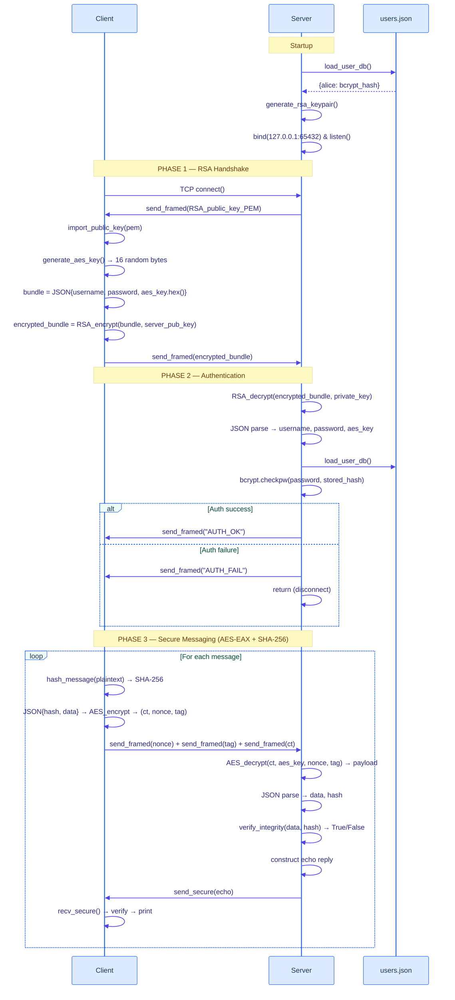

---

#### Phase 1: RSA Handshake — "The Key Exchange"

**Why it exists:** The client and server have never communicated before. They need to agree on a shared secret (the AES session key) without an attacker being able to intercept it. RSA solves this: only the server's private key can decrypt what the client encrypts with the server's public key.

**What happens internally:**
- Server generates a fresh 2048-bit RSA keypair on every startup.
- Server sends its **public key** (PEM format, plain text — safe to expose) to the client.
- Client generates 16 cryptographically random bytes → the **AES session key**.
- Client packs username, password, and AES key into a JSON object.
- Client encrypts that JSON with the server's RSA public key (OAEP padding).
- The encrypted blob is sent to the server — **only the server can decrypt it**.

**Data passed:** `[4-byte length][RSA-2048-OAEP encrypted JSON blob]`

**Output of this phase:** Both sides now share the same 16-byte AES session key. Securely. Without ever transmitting it in plaintext.

---

#### Phase 2: Authentication — "Who Are You?"

**Why it exists:** Key exchange proves mathematical security, but not identity. Authentication ensures the client is a registered, legitimate user.

**What happens internally:**
- Server decrypts the bundle using its RSA private key.
- Extracts `username`, `password`, `aes_key`.
- Loads `users.json` (the bcrypt password database).
- Calls `bcrypt.checkpw(password.encode(), stored_hash.encode())`.
- bcrypt re-computes the hash using the stored salt and compares — this is **intentionally slow** (cost factor 12) to defeat brute-force attacks.
- If valid → sends `AUTH_OK` and stores the AES key. If invalid → sends `AUTH_FAIL` and closes.

**Data passed:** `AUTH_OK` or `AUTH_FAIL` as a framed byte string.

**Output of this phase:** Authenticated session. Both parties trust each other and share the AES session key.

---

#### Phase 3: Secure Messaging — "The Protected Channel"

**Why it exists:** Now that identity is established and the key is shared, all actual communication must be encrypted AND integrity-checked.

**What happens internally (send side):**
1. Compute `SHA-256(plaintext)` → 64-char hex digest.
2. Wrap into JSON: `{"hash": "abc123...", "data": "Hello!"}`.
3. Encode JSON to bytes.
4. Encrypt the entire JSON bytes with AES-128-EAX → `(ciphertext, nonce, tag)`.
5. Send three length-prefixed frames: nonce → tag → ciphertext.

**What happens internally (receive side):**
1. Read three frames: nonce, tag, ciphertext.
2. Decrypt with AES-EAX (this also verifies the tag — if it fails, data was tampered).
3. JSON-parse the decrypted payload.
4. Re-compute SHA-256 of the data field and compare against the stored hash.
5. If both checks pass → return the plaintext. If either fails → raise `ValueError`.

**Output of this phase:** The server echoes each message back. Both sides confirm bidirectional encrypted communication works.

---

## 4. Module & Function Breakdown

### `modules/hash_module.py` — SHA-256 Integrity Layer

This module answers the question: *"Has this message been changed?"*

#### `hash_message(message: bytes) → str`

```
Input:  Raw bytes of any length
Output: 64-character hex string (256-bit SHA-256 digest)
Logic:  SHA256.new(message).hexdigest()
```

SHA-256 is a **one-way function** — given the hash, you cannot recover the original message. And any single bit change in the input produces a completely different hash (avalanche effect). This makes it ideal for tamper detection.

```
"Hello" → a591a6d40bf420404a011733cfb7b190d62c65bf0bcda32b57b277d9ad9f146e
"Hellо" → (completely different 64 chars — even with a Cyrillic 'о')
```

#### `verify_integrity(message: bytes, expected_hash: str) → bool`

```
Input:  The received message bytes + the expected hash string
Output: True if hash matches, False if tampered
Logic:  hash_message(message) == expected_hash.lower()
```

Used inside `recv_secure()` after decryption. The hash travels **inside the encrypted payload**, so an attacker cannot forge a valid hash without the AES key.

#### `hash_file(filepath: str) → str`

```
Input:  File path string
Output: SHA-256 hex digest of the entire file
Logic:  Streams the file in 64KB chunks to avoid loading huge files into RAM
```

Useful for verifying file integrity at rest — e.g., checking that a downloaded file has not been corrupted.

---

### `modules/aes_module.py` — AES-128-EAX Symmetric Encryption

This module answers: *"How do we encrypt bulk data efficiently?"*

AES (Advanced Encryption Standard) is the global standard for symmetric encryption. **EAX mode** is special — it provides both **encryption** (confidentiality) and an **authentication tag** (integrity) in a single pass. This is called Authenticated Encryption with Associated Data (AEAD).

#### `generate_aes_key() → bytes`

```
Input:  None
Output: 16 cryptographically random bytes (128-bit key)
Logic:  get_random_bytes(16) from OS entropy source
```

This is **not** `random.randbytes()`. `get_random_bytes` draws from the operating system's cryptographic random number generator (`/dev/urandom` on Linux, `CryptGenRandom` on Windows), which is seeded from hardware entropy. Predictability is impossible.

#### `encrypt(plaintext: bytes, key: bytes) → (ciphertext, nonce, tag)`

```
Input:  Plaintext bytes + 16-byte AES key
Output: (ciphertext bytes, nonce bytes, tag bytes)
Logic:
  1. AES.new(key, AES.MODE_EAX)  — creates cipher with fresh random nonce
  2. cipher.encrypt_and_digest(plaintext) — encrypts and computes MAC tag
  3. Return (ciphertext, cipher.nonce, tag)
```

- **Nonce (Number Used Once):** A 16-byte random value generated fresh per encryption. Even if you encrypt the same message twice with the same key, different nonces produce completely different ciphertexts. This prevents pattern analysis.
- **Tag:** A 16-byte Message Authentication Code (MAC). The receiver uses it to detect any bit-level tampering, even before decrypting.

#### `decrypt(ciphertext, key, nonce, tag) → bytes`

```
Input:  Ciphertext + key + nonce + tag
Output: Plaintext bytes
Raises: ValueError if tag verification fails (tamper detected)
Logic:
  1. AES.new(key, AES.MODE_EAX, nonce=nonce)
  2. cipher.decrypt_and_verify(ciphertext, tag)
  3. If tag invalid → raises ValueError before returning ANY data
```

The critical detail: EAX mode **verifies the tag before returning the plaintext**. This prevents a class of attack called "chosen ciphertext attack" — you never see partially decrypted tampered data.

#### `EncryptionWorker(threading.Thread)` — Background Encryption Thread

```
Input at init: plaintext_queue (Queue), ciphertext_queue (Queue)
Behavior:      Continuously reads from plaintext_queue, encrypts, puts into ciphertext_queue
Stops when:    plaintext_queue receives None (sentinel value)
Output:        (ciphertext, nonce, tag) tuples in ciphertext_queue
```

This implements the **producer-consumer pattern** for high-throughput scenarios. A producer thread generates plaintext; the EncryptionWorker encrypts it; a consumer thread handles the ciphertexts. The worker thread runs as a daemon (`.daemon = True`) so it auto-terminates when the main program exits.

```mermaid
flowchart LR
    P(["Producer Thread<br/>puts plaintext"])
    Q1["plaintext_queue"]
    W["EncryptionWorker<br/>calls encrypt()"]
    Q2["ciphertext_queue"]
    C(["Consumer Thread<br/>handles ciphertext"])

    P -->|"plaintext bytes"| Q1
    Q1 -->|"queue.get()"| W
    W -->|"(ct, nonce, tag)"| Q2
    Q2 -->|"queue.get()"| C

    style P  fill:#dbeafe,stroke:#2563eb,stroke-width:2px,color:#1e3a5f
    style Q1 fill:#f3f4f6,stroke:#6b7280,stroke-width:2px,color:#374151
    style W  fill:#d1fae5,stroke:#059669,stroke-width:2px,color:#064e3b
    style Q2 fill:#f3f4f6,stroke:#6b7280,stroke-width:2px,color:#374151
    style C  fill:#bbf7d0,stroke:#16a34a,stroke-width:3px,color:#14532d
```

---

### `modules/rsa_module.py` — RSA-2048-OAEP Asymmetric Encryption

This module answers: *"How do two parties share a secret key without ever meeting?"*

RSA is a **public-key cryptosystem**. Every party has two mathematically linked keys:
- **Public key:** Freely shared. Anyone can encrypt with it.
- **Private key:** Never shared. Only the owner can decrypt.

The math is based on the practical impossibility of factoring the product of two very large prime numbers.

#### `generate_rsa_keypair(bits=2048) → (private_key, public_key)`

```
Input:  Key size in bits (2048 default)
Output: (private_key object, public_key object)
Logic:  RSA.generate(2048) — internally finds two large primes p, q
        public_key = private_key.publickey()
```

2048-bit RSA provides approximately 112 bits of security — sufficient by current NIST standards until 2030+.

#### `encrypt_with_public_key(data: bytes, public_key) → bytes`

```
Input:  Data bytes (max ~214 bytes for RSA-2048) + public key object
Output: 256-byte RSA-OAEP ciphertext
Logic:  PKCS1_OAEP.new(public_key).encrypt(data)
```

**OAEP (Optimal Asymmetric Encryption Padding)** adds randomness to the encryption process. Encrypting the same data twice with the same key produces different ciphertexts — this prevents an attacker from recognizing patterns. Without OAEP, textbook RSA is deterministic and vulnerable.

The 214-byte limit exists because RSA operates on numbers modulo n (2048 bits = 256 bytes), and OAEP padding consumes ~42 bytes overhead.

#### `decrypt_with_private_key(ciphertext: bytes, private_key) → bytes`

```
Input:  256-byte RSA ciphertext + private key object
Output: Original plaintext bytes
Raises: ValueError if decryption fails (wrong key or corrupted data)
```

#### `export_public_key(public_key) → str` / `import_public_key(pem: str)`

These functions serialize/deserialize a public key to/from PEM format — the standard text format starting with `-----BEGIN PUBLIC KEY-----`. Used during the handshake to transmit the server's public key to the client over the socket.

---

### `modules/key_manager.py` — Secure Key Storage

This module answers: *"If we have keys, where and how do we store them safely?"*

Storing a private key in a plaintext file on disk is a critical security mistake. A stolen laptop would expose everything. This module encrypts keys before writing them.

#### `save_aes_key(key, filepath)` / `load_aes_key(filepath)`

```
Writes/reads raw 16 bytes to/from a binary file.
Note: AES keys require no special protection here — they are session keys
      used only in RAM during the demo. Disk storage is for persistence demos.
```

#### `save_rsa_private_key(private_key, filepath, passphrase)`

```
Input:  RSA private key object + filepath + passphrase string
Output: Encrypted PEM file on disk
Logic:
  1. private_key.export_key(format="PEM", passphrase=passphrase.encode(),
        pkcs=8, protection="scryptAndAES256-CBC")
  2. pycryptodome internally:
     a. Derives a 32-byte key from passphrase using scrypt (memory-hard KDF)
     b. Encrypts the private key bytes using AES-256-CBC
     c. Writes as a PKCS#8 encrypted PEM file
```

**scrypt** is a key derivation function designed to be expensive in both CPU time and memory. This defeats hardware (GPU/ASIC) brute-force attacks on the passphrase — even if an attacker steals the PEM file.

#### `load_rsa_private_key(filepath, passphrase)`

```
Input:  Encrypted PEM file path + passphrase
Output: RSA private key object
Raises: ValueError if wrong passphrase (scrypt+AES decryption fails)
```

---

### `modules/auth_module.py` — Password Authentication

This module answers: *"How do we verify a user is who they claim to be, without storing their password?"*

#### `register_user(username, password, db)`

```
Input:  username string + plaintext password + db dict (modified in-place)
Output: db[username] = bcrypt_hash_string
Logic:
  1. Check username not already in db (raise ValueError if duplicate)
  2. salt = bcrypt.gensalt()  — 128-bit random salt
  3. hashed = bcrypt.hashpw(password.encode("utf-8"), salt)
  4. db[username] = hashed.decode("utf-8")
```

The **salt** is critical — it is randomly generated per user. Even if two users have the same password, their stored hashes will be completely different. This defeats **rainbow table attacks** (precomputed hash lookup tables).

#### `authenticate_user(username, password, db) → bool`

```
Input:  username + plaintext password + db dict
Output: True if valid, False otherwise
Logic:
  1. If username not in db → return False (no timing side-channel on missing users)
  2. stored_hash = db[username].encode("utf-8")
  3. return bcrypt.checkpw(password.encode("utf-8"), stored_hash)
```

`bcrypt.checkpw` extracts the salt from the stored hash, re-computes bcrypt with that salt, and compares. The cost factor (12 by default from `gensalt()`) means each check takes ~100–300ms — fast for a human, catastrophically slow for brute-force (millions of attempts).

#### `save_user_db(db, filepath)` / `load_user_db(filepath)`

```
Serializes/deserializes the db dict as JSON.
load_user_db returns {} (not an error) if the file doesn't exist — safe default.
```

---

### `demo/server.py` — The Secure TCP Server

The server is the orchestrator of the entire protocol. It combines all five modules into a working network application.

#### `send_framed(sock, data)` / `recv_framed(sock)`

```
send_framed: struct.pack(">I", len(data)) + data  → prepends 4-byte big-endian length
recv_framed: reads exactly 4 bytes → parses length N → reads exactly N bytes
```

This is **length-prefix framing** — a fundamental TCP pattern. TCP is a stream protocol — it doesn't preserve message boundaries. Without this, `recv()` might return half a message or two messages merged together. The 4-byte prefix tells the receiver exactly how many bytes to expect.

#### `_recv_exact(sock, n) → bytes`

```
Input:  socket + exact number of bytes to read
Output: exactly n bytes
Logic:  Loop calling sock.recv() until n bytes accumulated
```

`sock.recv(n)` may return fewer than `n` bytes (TCP fragmentation). `_recv_exact` guarantees completeness. This is a critical reliability function that prevents corrupt reads.

#### `send_secure(sock, aes_key, plaintext)` / `recv_secure(sock, aes_key)`

These are the high-level secure channel functions. They combine all cryptographic modules:

```
send_secure:
  hash_message(plaintext) → digest
  JSON.dumps({"hash": digest, "data": plaintext}) → payload_bytes
  encrypt(payload_bytes, aes_key) → (ct, nonce, tag)
  send_framed(nonce) + send_framed(tag) + send_framed(ct)

recv_secure:
  nonce = recv_framed()
  tag   = recv_framed()
  ct    = recv_framed()
  payload = decrypt(ct, aes_key, nonce, tag)    ← raises if tampered
  envelope = JSON.parse(payload)
  if not verify_integrity(envelope["data"], envelope["hash"]):
      raise ValueError("Integrity check failed")
  return envelope["data"].encode()
```

The **double integrity check** is intentional:
1. **AES-EAX tag** verifies the ciphertext was not modified in transit.
2. **SHA-256 hash** (inside the payload) verifies the plaintext was not tampered *before* encryption (catches cases where someone replayed an old encrypted message with swapped content).

---

### `demo/client.py` — The Secure TCP Client

The client mirrors the server's protocol. Key distinction: the client **generates** the AES session key and transmits it securely, while the server **receives** and stores it.

#### `main(username, password)`

The client's entire protocol is a single sequential function:
1. TCP connect → receive RSA public key → import it.
2. Generate AES session key → bundle credentials → RSA-encrypt bundle → send.
3. Receive AUTH_OK/FAIL → exit if failed.
4. Loop: send_secure → recv_secure for each demo message.

---

### `main.py` — Interactive CLI Entry Point

`main.py` is the user-facing shell. It does not contain any cryptographic logic — it delegates entirely to the modules and demo scripts.

**Architecture pattern:** `ACTIONS` dictionary maps menu strings to function objects. This is the **Command pattern** — adding a new demo option requires only adding one entry to the dict.

```python
ACTIONS = {
    "1": demo_hash,
    "2": demo_aes,
    ...
    "7": start_server,   # spawns demo/server.py as subprocess
    "8": start_client,   # spawns demo/client.py as subprocess
}
```

Options 7 and 8 use `subprocess.run()` to launch the server/client as separate OS processes — necessary because the server blocks on `accept()` and the client would need to run concurrently in a real scenario.

---

## 5. Security Logic & Detection Flow

### The Layered Security Model

The system implements **Defense in Depth** — multiple independent security layers so that breaking one layer does not compromise the system.

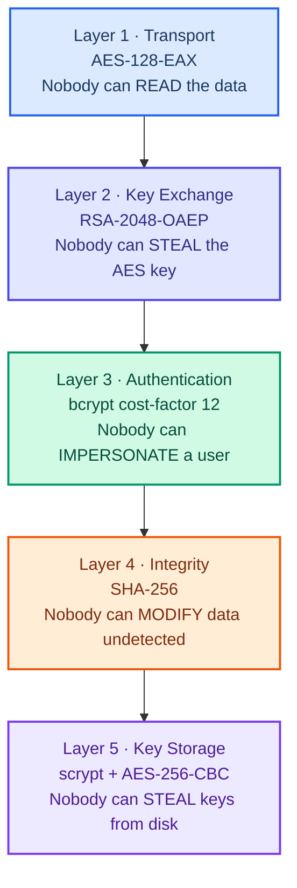

### Authentication Flow

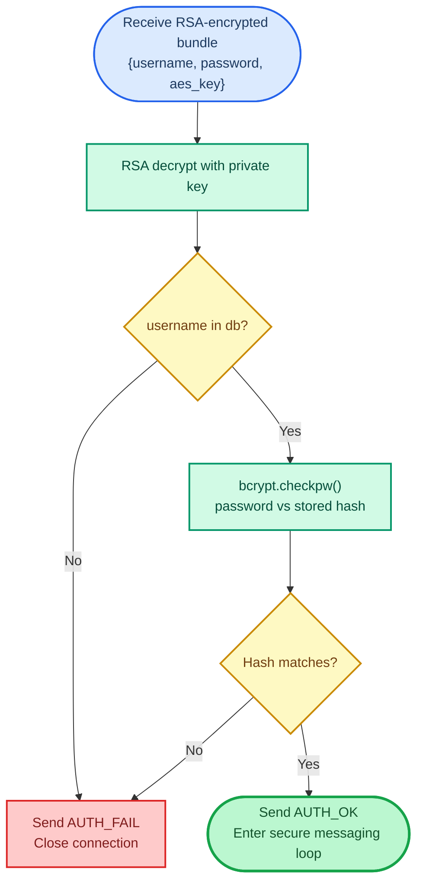

**Why bcrypt and not SHA-256 for passwords?**

SHA-256 is designed to be **fast** (billions of hashes/second on a GPU). For password storage, fast is bad — an attacker with the database can try billions of passwords per second.

bcrypt is designed to be **slow** — each computation involves thousands of iterations and 4KB of memory. At cost factor 12:
- Legitimate login: ~200ms (acceptable for a human)
- Brute-force at scale: billions of years (economically impossible)

### Message Integrity Detection Flow

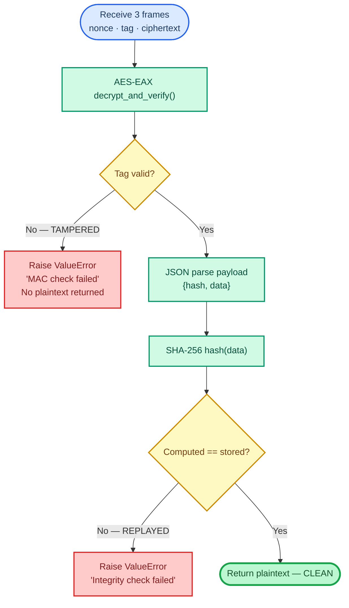

### Threat Model & Mitigations

```mermaid
graph TB
    ROOT{{"Security Threats & Mitigations"}}

    ROOT --> T1["Eavesdropping<br/>reads network traffic"]
    ROOT --> T2["Man-in-the-Middle<br/>intercepts key exchange"]
    ROOT --> T3["Replay Attacks<br/>resends old messages"]
    ROOT --> T4["Brute-Force Password<br/>tries millions of guesses"]
    ROOT --> T5["Stolen Key Files<br/>copies PEM from disk"]
    ROOT --> T6["Ciphertext Tampering<br/>modifies bytes in transit"]
    ROOT --> T7["Timing Side-Channels<br/>measures response time"]

    T1 --> M1["AES-128-EAX encrypts all data<br/>key never in plaintext"]
    T2 --> M2["RSA-OAEP: only server<br/>private key decrypts"]
    T3 --> M3["Fresh nonce per message<br/>prevents replay decryption"]
    T4 --> M4["bcrypt cost factor 12<br/>~200 ms per attempt"]
    T5 --> M5["scrypt + AES-256-CBC<br/>passphrase required"]
    T6 --> M6["AES-EAX tag raises ValueError<br/>no plaintext returned"]
    T7 --> M7["bcrypt constant-time<br/>comparison"]

    style ROOT fill:#fef9c3,stroke:#ca8a04,stroke-width:2px,color:#713f12
    style T1 fill:#fecaca,stroke:#dc2626,stroke-width:2px,color:#7f1d1d
    style T2 fill:#fecaca,stroke:#dc2626,stroke-width:2px,color:#7f1d1d
    style T3 fill:#fecaca,stroke:#dc2626,stroke-width:2px,color:#7f1d1d
    style T4 fill:#fecaca,stroke:#dc2626,stroke-width:2px,color:#7f1d1d
    style T5 fill:#fecaca,stroke:#dc2626,stroke-width:2px,color:#7f1d1d
    style T6 fill:#fecaca,stroke:#dc2626,stroke-width:2px,color:#7f1d1d
    style T7 fill:#fecaca,stroke:#dc2626,stroke-width:2px,color:#7f1d1d
    style M1 fill:#bbf7d0,stroke:#16a34a,stroke-width:2px,color:#14532d
    style M2 fill:#bbf7d0,stroke:#16a34a,stroke-width:2px,color:#14532d
    style M3 fill:#bbf7d0,stroke:#16a34a,stroke-width:2px,color:#14532d
    style M4 fill:#bbf7d0,stroke:#16a34a,stroke-width:2px,color:#14532d
    style M5 fill:#bbf7d0,stroke:#16a34a,stroke-width:2px,color:#14532d
    style M6 fill:#bbf7d0,stroke:#16a34a,stroke-width:2px,color:#14532d
    style M7 fill:#bbf7d0,stroke:#16a34a,stroke-width:2px,color:#14532d
```

### Key Exchange State Machine

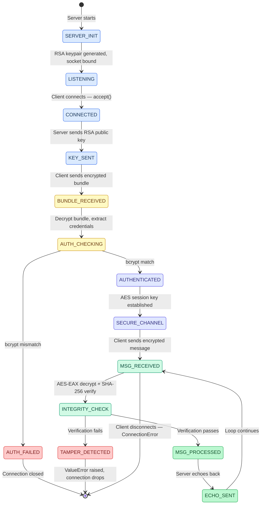

### Wire Protocol Structure

Every message in the secure channel follows a strict binary format:

```
┌─────────────────────────────────────────────────────┐
│                  SECURE MESSAGE FRAME                │
├──────────┬────────────────────────────────────────── │
│ 4 bytes  │  Nonce length (always 16)                 │
│ 16 bytes │  AES-EAX Nonce (random, unique per msg)   │
├──────────┼──────────────────────────────────────────-│
│ 4 bytes  │  Tag length (always 16)                   │
│ 16 bytes │  AES-EAX Authentication Tag               │
├──────────┼───────────────────────────────────────────│
│ 4 bytes  │  Ciphertext length (variable)             │
│ N bytes  │  AES-EAX Ciphertext                       │
└──────────┴───────────────────────────────────────────┘

Ciphertext decrypts to JSON:
{
    "hash": "<64-char SHA-256 hex digest>",
    "data": "<original plaintext message>"
}
```

### Function Interaction Map

```mermaid
flowchart TD
    subgraph SERVER["server.py"]
        direction TB
        M(["main()"])
        SF["send_framed()"]
        RF["recv_framed()"]
        RE["_recv_exact()"]
        SS["send_secure()"]
        RS["recv_secure()"]
    end

    subgraph CRYPTO["modules/"]
        direction TB
        GK["generate_rsa_keypair()"]
        EPK["export_public_key()"]
        DPK["decrypt_with_private_key()"]
        ENC["encrypt()"]
        DEC["decrypt()"]
        HM["hash_message()"]
        VI["verify_integrity()"]
        LDB["load_user_db()"]
        AU["authenticate_user()"]
    end

    M --> GK
    M --> EPK
    M --> SF
    M --> RF
    M --> DPK
    M --> LDB
    M --> AU
    M --> SS
    M --> RS

    RF --> RE
    SS --> HM
    SS --> ENC
    SS --> SF
    RS --> RF
    RS --> DEC
    RS --> VI

    style M   fill:#e0e7ff,stroke:#4f46e5,stroke-width:2px,color:#312e81
    style SF  fill:#ffedd5,stroke:#ea580c,stroke-width:2px,color:#7c2d12
    style RF  fill:#ffedd5,stroke:#ea580c,stroke-width:2px,color:#7c2d12
    style RE  fill:#ffedd5,stroke:#ea580c,stroke-width:2px,color:#7c2d12
    style SS  fill:#d1fae5,stroke:#059669,stroke-width:2px,color:#064e3b
    style RS  fill:#d1fae5,stroke:#059669,stroke-width:2px,color:#064e3b
    style GK  fill:#e0e7ff,stroke:#4f46e5,stroke-width:2px,color:#312e81
    style EPK fill:#d1fae5,stroke:#059669,stroke-width:2px,color:#064e3b
    style DPK fill:#d1fae5,stroke:#059669,stroke-width:2px,color:#064e3b
    style ENC fill:#d1fae5,stroke:#059669,stroke-width:2px,color:#064e3b
    style DEC fill:#d1fae5,stroke:#059669,stroke-width:2px,color:#064e3b
    style HM  fill:#d1fae5,stroke:#059669,stroke-width:2px,color:#064e3b
    style VI  fill:#d1fae5,stroke:#059669,stroke-width:2px,color:#064e3b
    style LDB fill:#f3f4f6,stroke:#6b7280,stroke-width:2px,color:#374151
    style AU  fill:#d1fae5,stroke:#059669,stroke-width:2px,color:#064e3b
    style SERVER fill:#fff7ed,stroke:#ea580c,stroke-width:2px,color:#7c2d12
    style CRYPTO fill:#ecfdf5,stroke:#059669,stroke-width:2px,color:#064e3b
```

---

## 6. Folder & File Structure

```
Secure-Communication-System/
│
├── main.py                    ← Entry point: interactive CLI menu
│
├── modules/                   ← Core cryptographic library
│   ├── __init__.py            ← Makes 'modules' a Python package
│   ├── aes_module.py          ← AES-128-EAX encryption/decryption + EncryptionWorker
│   ├── rsa_module.py          ← RSA-2048-OAEP encrypt/decrypt + PEM import/export
│   ├── hash_module.py         ← SHA-256 hashing + integrity verification
│   ├── key_manager.py         ← Key save/load: AES (raw) + RSA (passphrase-protected PEM)
│   └── auth_module.py         ← bcrypt user registration + authentication + JSON DB
│
├── demo/                      ← Working network demonstration
│   ├── server.py              ← TCP server: RSA handshake + auth + AES-EAX messaging
│   ├── client.py              ← TCP client: connects, authenticates, sends encrypted messages
│   └── users.json             ← Auto-created: bcrypt password database (never plaintext)
│
├── tests/                     ← Unit test suite (31 tests total)
│   ├── test_hash.py           ← 6 tests: SHA-256 correctness, verify_integrity behavior
│   ├── test_aes.py            ← 8 tests: key gen, encrypt/decrypt, tamper detection
│   ├── test_rsa.py            ← 6 tests: keypair gen, OAEP round-trip, PEM export
│   ├── test_key_manager.py    ← 4 tests: AES/RSA key file save/load round-trips
│   └── test_auth.py           ← 7 tests: registration, auth, wrong password, bcrypt storage
│
├── requirements.txt           ← pycryptodome==3.20.0, bcrypt==4.1.3
├── README.md                  ← Project documentation and usage guide
├── .gitignore                 ← Excludes __pycache__, .venv, *.pem, demo/users.json
└── .claude/
    └── settings.local.json    ← Claude Code project configuration
```

### Why This Structure?

- **`modules/` is a pure library** — no network code, no I/O, only cryptographic logic. This makes it independently testable and reusable.
- **`demo/` is the application layer** — imports from `modules/` and adds networking. Separated so the crypto logic is not polluted with socket code.
- **`tests/` mirrors `modules/`** — one test file per module. Clear 1:1 correspondence.
- **`main.py` is the composition root** — wires everything together for the user.

---

## 7. Execution Flow

### Startup Sequence

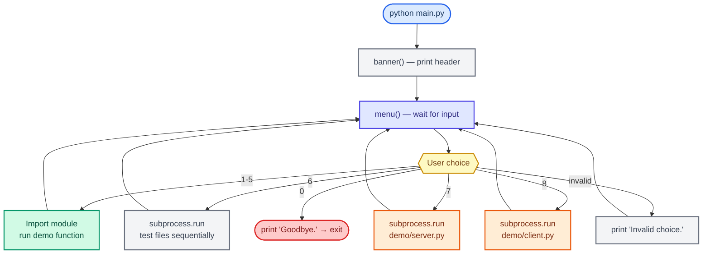

### Server Initialization Sequence

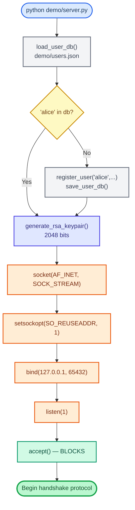

`SO_REUSEADDR` allows the server to restart immediately after closing without waiting for the OS `TIME_WAIT` period (which normally takes ~60 seconds).

### Main Event Loop (Server Messaging)

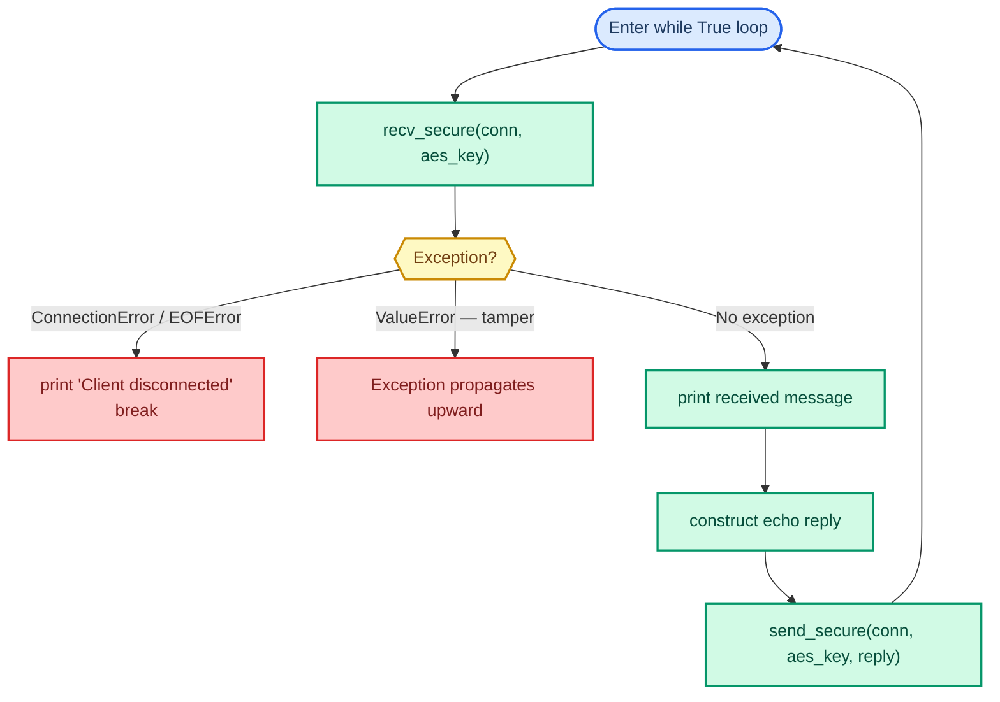

### Shutdown Behavior

- **Server:** The `with conn:` context manager auto-closes the socket when the loop exits. The outer `with socket.socket(...) as srv:` closes the listening socket.
- **Client:** `with socket.socket(...) as sock:` closes after the message loop ends.
- **EncryptionWorker thread:** `.daemon = True` means it terminates automatically when the main thread exits — no explicit cleanup needed.
- **Key files:** The key manager demo uses `tempfile.TemporaryDirectory()` as a context manager — all temporary key files are deleted automatically when the `with` block exits.

---

## 8. Technical Design Decisions

### Why AES-EAX and not AES-CBC?

| Mode | Encryption | Integrity | Nonce Required | Vulnerable to |
|---|---|---|---|---|
| AES-CBC | Yes | No (separate HMAC needed) | IV | Padding oracle attacks if no MAC |
| AES-EAX | Yes | Yes (built-in MAC tag) | Yes | None known |
| AES-GCM | Yes | Yes | Yes | Nonce reuse (catastrophic) |

AES-EAX provides **authenticated encryption** in one step. Forgetting to add a separate MAC to AES-CBC is a common implementation mistake that leads to padding oracle attacks (see BEAST, POODLE attacks on TLS). EAX eliminates this class of error by design.

### Why RSA-2048 and not a smaller key?

RSA-1024 is considered broken (factorable with sufficient resources). RSA-2048 is the NIST-recommended minimum for use beyond 2013. The tradeoff is generation time (~0.5–2 seconds) versus security. In this system, RSA is only used once per session (for key exchange), so the cost is acceptable.

### Why Hybrid Encryption (RSA + AES)?

RSA cannot efficiently encrypt large amounts of data:
- RSA-2048 maximum plaintext: ~214 bytes
- RSA is ~1000x slower than AES for equivalent data sizes

The industry-standard solution is **hybrid encryption**:
1. Use RSA (asymmetric) to securely exchange a small random key.
2. Use AES (symmetric) for all actual data — fast, no size limit.

This is exactly how TLS/HTTPS works.

### Why bcrypt and not SHA-256 for passwords?

Cryptographic hash functions like SHA-256 are designed to be fast. Password hashing needs to be slow. bcrypt's cost factor directly controls computation time — as hardware gets faster, you increase the cost factor.

Additionally, bcrypt has built-in salting. A common mistake is to implement "salted SHA-256" manually — bcrypt makes salting mandatory and automatic.

### Why scrypt for key file protection?

scrypt is **memory-hard** — in addition to CPU time, it requires a large amount of RAM. This defeats specialized hardware (ASICs, FPGAs) designed for fast hash computation. Even a GPU cluster with billions of SHA-256/second attempts/second is bottlenecked by memory bandwidth when attacking scrypt.

### Why SHA-256 *inside* the encrypted payload?

The AES-EAX tag already provides integrity. So why add SHA-256?

The SHA-256 hash is computed over the **plaintext** before encryption. The AES tag covers the **ciphertext**. If an attacker somehow managed to construct a valid ciphertext (through an oracle attack), the inner SHA-256 check would catch any semantic modification of the plaintext content. It is a belt-and-suspenders approach — two independent integrity mechanisms that cover different attack vectors.

### Why Length-Prefix Framing (not line-based or delimiter-based)?

TCP is a byte stream — there are no natural message boundaries. Common alternatives:
- **Delimiter-based (`\n`):** Breaks if the payload contains the delimiter. Requires escaping.
- **Fixed-size messages:** Wastes bandwidth for short messages, fails for long ones.
- **Length-prefix (chosen here):** Universal, handles binary data, no escaping, O(1) parsing.

4 bytes allows frames up to 4GB — far more than needed.

### Scalability Considerations

| Current Limitation | Production Solution |
|---|---|
| Handles only 1 client (no threading) | Use `threading.Thread` per connection or `asyncio` |
| Users stored in flat JSON file | Replace with a proper database (PostgreSQL + bcrypt) |
| RSA key regenerated on every startup | Use a persistent CA-signed certificate (PKI) |
| No session expiry | Add JWT tokens or session timeout logic |
| localhost only | Deploy with TLS (or keep this as the application-layer TLS) |
| No logging | Add Python `logging` module with rotating file handler |

---

## 9. Error Handling & Edge Cases

### Cryptographic Error Handling

| Error Scenario | Where It Occurs | Exception | System Response |
|---|---|---|---|
| AES tag mismatch (tampered ciphertext) | `decrypt()` → `decrypt_and_verify()` | `ValueError: MAC check failed` | Propagates up, connection closes |
| Wrong AES key | `decrypt()` | `ValueError` | Same as above |
| Wrong RSA private key | `decrypt_with_private_key()` | `ValueError` | Server returns AUTH_FAIL |
| Corrupted RSA ciphertext | `decrypt_with_private_key()` | `ValueError` | Server returns AUTH_FAIL |
| Wrong passphrase for PEM | `load_rsa_private_key()` | `ValueError` | Caller must handle |
| SHA-256 hash mismatch | `recv_secure()` → `verify_integrity()` | `ValueError: Integrity check failed` | Connection closes |
| Duplicate user registration | `register_user()` | `ValueError` | Caller must handle |

### Network Error Handling

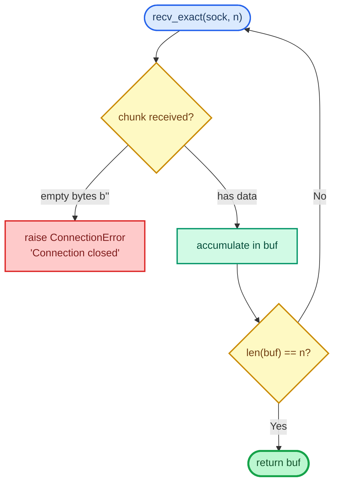

The `_recv_exact()` function handles TCP fragmentation — the OS may deliver data in multiple partial chunks. The loop guarantees exactly `n` bytes are read before returning.

In the server's messaging loop:
```python
except (ConnectionError, EOFError):
    print("[SERVER] Client disconnected.")
    break
```

Normal client disconnection raises `ConnectionError` which is caught gracefully — no stack trace printed to users.

### Edge Cases in Each Module

**AES Module:**
- **Empty plaintext:** Handled correctly — AES-EAX can encrypt 0 bytes. The tag still provides integrity.
- **Same message twice:** Different nonces guarantee different ciphertexts. Prevents replay pattern analysis.
- **Key of wrong length:** pycryptodome raises `ValueError: AES key must be 16, 24, or 32 bytes long` immediately at cipher creation.

**RSA Module:**
- **Plaintext too large:** OAEP raises `ValueError: Plaintext is too long`. The JSON bundle (username + password + 32-char hex AES key) is well within the ~214-byte limit.
- **Import of corrupted PEM:** `RSA.import_key()` raises `ValueError`.

**Auth Module:**
- **Missing users.json:** `load_user_db()` returns `{}` (empty dict) — server creates the file fresh. This is correct behavior for first-run initialization.
- **Duplicate registration:** `register_user()` raises `ValueError("User 'X' already exists")` — prevents silent overwrites.

**Key Manager:**
- **Missing parent directory:** `os.makedirs(..., exist_ok=True)` auto-creates directories. The `exist_ok=True` flag prevents errors if the directory already exists.
- **Wrong passphrase:** scrypt-derived key will be wrong, AES-256-CBC decryption will produce garbage bytes, PEM parsing will fail → `ValueError` raised.

### Security Risks and Mitigations

| Risk | Severity | Current State | Mitigation in This System |
|---|---|---|---|
| No TLS certificate verification | High | Demo uses localhost | Add certificate pinning / CA verification in production |
| Password sent inside RSA-encrypted bundle | Medium | Acceptable for demo | In production, use challenge-response (never send password) |
| No session token / expiry | Medium | Demo only | Implement JWT or session ID with timeout |
| bcrypt cost factor may be too low for future hardware | Low | Factor 12 is current standard | Make cost factor configurable, increase as hardware evolves |
| Nonce reuse in EncryptionWorker if cipher is reused | High (theoretical) | Worker uses `encrypt()` which creates fresh cipher per call | Already mitigated — fresh nonce every call |
| JSON payload not length-limited | Low | Demo with trusted input | Add max-length validation at recv boundary |

---

## 10. Summary

### End-to-End Simplified Explanation

Imagine Alice wants to send Bob a secret message, but they've never met:

1. **Bob generates two keys** — a public padlock (public key) and the only key that opens it (private key). He sends Alice the open padlock.

2. **Alice puts a new secret code (AES key) and her name/password in a box**, locks it with Bob's padlock, and sends it. Nobody else can open it — only Bob's private key can.

3. **Bob opens the box**, verifies Alice's password against his stored bcrypt records, and says "OK, I trust you."

4. **From now on**, both use the secret AES code to scramble all messages. Every message also gets a fingerprint (SHA-256) attached inside the scrambled envelope. If anyone tampers with the scrambled message in transit, the fingerprint won't match and the message is rejected.

That's the entire system — RSA solves the "how do we share a secret" problem, bcrypt solves the "are you who you say you are" problem, AES solves the "how do we talk privately" problem, and SHA-256 solves the "has anything changed" problem.

---

### Key Architectural Concepts to Remember

| Concept | Implementation | Why It Matters |
|---|---|---|
| **Hybrid Encryption** | RSA for key exchange + AES for data | RSA is too slow for bulk data; AES needs a secure way to share the key |
| **Authenticated Encryption** | AES-EAX (encryption + MAC in one step) | Prevents padding oracle attacks from modes like CBC |
| **Nonce (IV) freshness** | `get_random_bytes(16)` per encryption | Nonce reuse in EAX/GCM leaks keystream and breaks confidentiality |
| **Password hashing ≠ data hashing** | bcrypt for passwords, SHA-256 for integrity | Different threat models require different functions |
| **Length-prefix framing** | 4-byte big-endian + data | TCP stream protocol needs explicit message boundaries |
| **Defense in depth** | 4 independent security layers | Breaking one layer doesn't compromise the system |
| **Stateful cipher objects** | Fresh `AES.new()` per encrypt call | AES-EAX cipher objects cannot be safely reused across messages |
| **Passphrase-protected keys** | scrypt + AES-256-CBC in PEM | Private keys at rest must be encrypted — a stolen file must be useless |

---

### Important Implementation Details

- **`_recv_exact()`** is the hidden critical function — without it, partial TCP reads would corrupt every message.
- **`SO_REUSEADDR`** on the server socket prevents "Address already in use" errors on restart.
- **`daemon = True`** on the EncryptionWorker means it never blocks program exit.
- **`with conn:`** and **`with socket.socket() as srv:`** guarantee socket cleanup even on exceptions.
- The **SHA-256 hash lives inside the AES ciphertext** — an attacker cannot forge a hash without first breaking AES.
- The **RSA keypair is regenerated on every server startup** — there is no persistent server identity (certificate). In production, use a CA-signed certificate.
- **`bcrypt.gensalt()`** defaults to cost factor 12 — each bcrypt verification takes ~0.1–0.3 seconds on modern hardware.
- The **AES key is transmitted as hex string** inside the JSON bundle — `aes_key.hex()` → transmitted → `bytes.fromhex(bundle["aes_key"])` on the server. This avoids binary encoding issues in JSON.

---

### Cryptography Quick Reference

| Algorithm | Type | Key Size | Use in This Project | Security Level |
|---|---|---|---|---|
| AES-128-EAX | Symmetric AEAD | 128 bits | Message encryption + integrity | ~128-bit security |
| RSA-2048-OAEP | Asymmetric | 2048 bits | Key exchange only | ~112-bit security |
| SHA-256 | Hash function | N/A (output: 256 bits) | Message fingerprinting | No known attacks |
| bcrypt | Password KDF | N/A (work factor 12) | Password storage | Brute-force resistant |
| scrypt | Memory-hard KDF | N/A | Key file protection | GPU/ASIC resistant |
| AES-256-CBC | Symmetric | 256 bits | Private key encryption on disk | ~256-bit security |

---

*Documentation generated for CSE451 — Secure Communication Suite.*
*Ain Shams University | Faculty of Engineering | Spring 2026*
